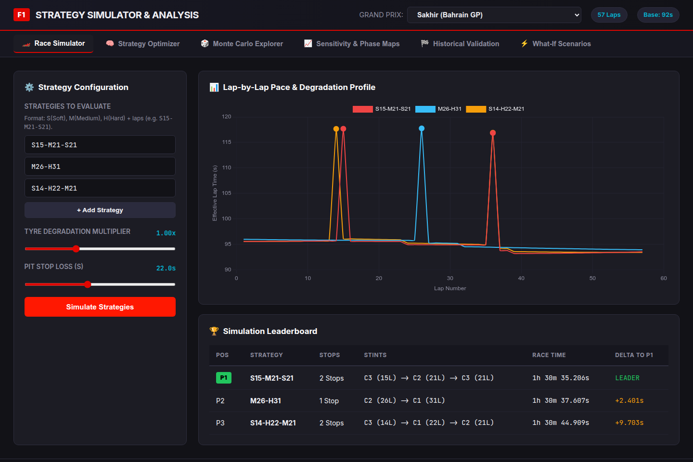

# Formula 1 Race Strategy Simulator 🏎️⏱️

A data-driven simulation and optimization engine for Formula 1 race strategy. Evaluates tyre and pit-stop strategies under stochastic uncertainty, computes stint pace profiles, models non-linear tyre degradation and fuel burn dynamics, discovers mathematically optimal strategies, and calculates tactical undercut/overcut pit windows.

<p align="center">
  
</p>

---

## 📌 Features

* **Interactive Web Dashboard**: Single-page dark-theme UI powered by FastAPI and Chart.js for real-time race simulation, DP optimization, Monte Carlo distributions, 2D phase maps, What-If scenarios, and historical telemetry validation.
* **Dynamic Programming Strategy Optimizer**: Global strategy discovery using Bellman backward induction across the Directed Acyclic Graph (DAG) of valid stints in `< 15ms`.
* **Combinatorial Grid Search**: Evaluates 19,000+ candidate stint configurations in `~0.5s` to rank top strategies.
* **Tactical Pit Windows**: Computes flexible undercut and overcut pit windows around optimal stop laps within an acceptable time penalty ($\delta_{\text{tol}}$).
* **Sensitivity Analysis & Tipping Points**: Computes exact crossover thresholds (e.g., degradation rate where 2-stop beats 1-stop) using Brent's method root-finding down to $10^{-4}$ precision.
* **2D Decision Phase Maps**: Generates decision boundary contour maps across Pit Loss ($16-32\text{s}$) and Tyre Degradation Multiplier ($0.6-2.2\times$).
* **What-If Scenario Sandbox**: Evaluates counterfactual track events (pit delays, degradation spikes, compound pace shifts, Safety Cars, 2026 technical regulations) and calculates **Strategic Regret** $\mathcal{R}$.
* **Monte Carlo Uncertainty Engine**: Vectorized stochastic simulations modeling lap time noise, heavy-tailed pit stop variance, Value-at-Risk ($P_{95}\text{ VaR}$), Expected Shortfall ($CVaR_{95}$), and head-to-head win probability matrices.
* **Real-World Telemetry Validation**: Ingests OpenF1 Grand Prix timing feeds, filters clean racing laps ($107\%$ median filter), fits constrained polynomial wear models ($\alpha_c, \beta_c$), and backtests against 2024 race winners with discrepancy diagnostics.
* **Demonstration Notebook Suite**: 5 executable Jupyter curriculum notebooks covering physics exploration, optimization, sensitivity, validation, and scenario analysis.

---

## 📐 Mathematical Model

### 1. Lap Time Synthesis
$$T_{\text{lap}}(n) = T_{\text{base}} + \Delta_{\text{compound}}(c) + D_c\big(a(n)\big) + F\big(m_f(n)\big) - E_{\text{track}}(n) + T_{\text{traffic}}(n)$$

* $T_{\text{base}}$: Theoretical clean-air track baseline pace (zero fuel, fresh tyres).
* $\Delta_{\text{compound}}(c)$: Compound pace offset relative to Medium baseline.
* $D_c(a)$: Non-linear tyre degradation penalty at tyre age $a$.
* $F(m_f)$: Lap time penalty from current fuel mass $m_f$.
* $E_{\text{track}}(n)$: Track evolution grip improvement from rubber deposition.
* $T_{\text{traffic}}(n)$: Dirty air and traffic wake time loss.

### 2. Tyre Wear & Thermal Cliff
$$D_c(a) = \alpha_c \cdot a + \beta_c \cdot a^2 + \kappa_c \cdot \big(\max(0, a - a_{\text{cliff}, c})\big)^2$$

* $\alpha_c$: Linear wear coefficient ($\text{s/lap}$).
* $\beta_c$: Quadratic fatigue coefficient ($\text{s/lap}^2$).
* $a_{\text{cliff}, c}$: Stint age threshold beyond which grip drops sharply.

### 3. Fuel Mass Depletion & Penalty
$$m_f(n) = m_{f, 0} - (n - 1) \cdot \Delta m_f, \quad F\big(m_f(n)\big) = \gamma_{\text{fuel}} \cdot m_f(n)$$

* $m_{f, 0}$: Initial fuel load ($100 - 105\text{ kg}$).
* $\Delta m_f$: Fuel consumption rate ($\approx 1.7 - 1.9\text{ kg/lap}$).
* $\gamma_{\text{fuel}}$: Fuel weight sensitivity ($\approx 0.030 - 0.035\text{ s/kg}$).

### 4. Total Race Duration
$$T_{\text{race}}(S) = \sum_{n=1}^N T_{\text{lap}}(n) + (K - 1) \cdot \Delta T_{\text{pit}}$$

where $K$ is the number of stints and $\Delta T_{\text{pit}}$ is the net pit lane time loss.

### 5. Strategic Regret
$$\mathcal{R}\big(S; \theta'\big) = J\big(S; \theta'\big) - \min_{S' \in \mathcal{S}} J\big(S'; \theta'\big) \ge 0$$

Measures the race time forfeited by adhering to a baseline strategy under a mutated track environment $\theta'$.

---

## 🚀 How to Use

### 1. Installation
```bash
git clone https://github.com/adem-temam/f1_race_strategy_simulator.git
cd f1_race_strategy_simulator
pip install -r requirements.txt
```

### 2. Interactive Web Dashboard
Launch the web dashboard with automatic browser opening:
```bash
python3 run_dashboard.py
```
Open **[http://127.0.0.1:8000](http://127.0.0.1:8000)** to access all interactive tabs.

Optional flags:
```bash
python3 run_dashboard.py --port 8080 --no-browser
```

### 3. Strategy Optimization
Find the mathematically optimal strategy and tactical pit windows:
```bash
# Optimize Bahrain GP (finds optimal 2-stop strategy and pit windows in ~0.5s)
python3 run_simulation.py --circuit bahrain --optimize

# Enforce maximum pit stops (e.g. 1-stop strategy at Monza)
python3 run_simulation.py --circuit monza --optimize --max-stops 1

# Optimize for lowest downside risk (P95 Value at Risk)
python3 run_simulation.py --circuit bahrain --optimize --objective risk --mc 500
```

### 4. Sensitivity Analysis & Decision Phase Maps
Analyze when and why strategies transition between 1-stop and 2-stop regimes:
```bash
# Compute exact critical tipping point (root finding) for tyre degradation
python3 run_simulation.py --circuit bahrain --crossover

# Compute tipping point for pit stop time loss
python3 run_simulation.py --circuit monza --crossover --param pit-loss

# Run 1D parameter sweep comparing 1-stop vs 2-stop
python3 run_simulation.py --circuit bahrain --sensitivity --param deg

# Generate 2D decision boundary phase diagram across Pit Loss and Degradation
python3 run_simulation.py --circuit bahrain --phase-map --plot
```

### 5. What-If Scenario Analysis
Evaluate counterfactual track interventions and calculate Strategic Regret:
```bash
# Run a specific scenario (severe degradation spike)
python3 run_simulation.py --circuit bahrain --scenario high_deg

# Evaluate an unexpected Safety Car neutralization at Lap 18
python3 run_simulation.py --circuit bahrain --scenario safety_car_lap18

# Run the complete 11-scenario counterfactual matrix
python3 run_simulation.py --circuit bahrain --run-all-scenarios
```

### 6. Real-World Telemetry Validation
Fit empirical wear parameters from real race data and backtest against 2024 winners:
```bash
# Run strategy backtest and causal discrepancy diagnostics on Bahrain GP
python3 run_simulation.py --circuit bahrain --validate

# Inspect empirical parameter regression table (wear alpha/beta, pit loss, lap noise)
python3 run_simulation.py --circuit barcelona --fit-params

# Run full validation suite with visual plots (wear curves, residuals, Gantt charts)
python3 run_validation.py --circuit monza --plot
```

### 7. Custom Stint Evaluation & Simulation
```bash
# Evaluate preset strategies on Bahrain GP
python3 run_simulation.py --circuit bahrain

# Evaluate custom stint sequences
python3 run_simulation.py --circuit bahrain -s "S15-M21-S21" -s "M26-H31"

# View per-lap physical breakdown (degradation, remaining fuel, lap pace)
python3 run_simulation.py --strategy "M26-H31" --laps
```

### 8. Monte Carlo Uncertainty Analysis
```bash
# Run 10,000 stochastic iterations (Expected Time, P95 Risk, Win Matrix)
python3 run_simulation.py --mc 10000

# Generate visual distribution plots (KDE, CDF, boxplots)
python3 run_simulation.py --mc 5000 --plot
```

### 9. Demonstration Jupyter Notebooks
```bash
jupyter notebook notebooks/
```
* `01_synthetic_model_exploration.ipynb`: Physics engine, tyre wear curves, and fuel mass burn.
* `02_monte_carlo_and_optimization.ipynb`: Stochastic risk modeling, win probability matrix, and Bellman DP.
* `03_sensitivity_and_decision_maps.ipynb`: Brent root-finding crossover tipping points and 2D phase diagrams.
* `04_historical_data_validation.ipynb`: OpenF1 telemetry ingestion, OLS regression, and Verstappen/Leclerc backtesting.
* `05_scenario_analysis_and_what_if.ipynb`: Counterfactual perturbations, strategic regret, and 2026 regulations.

---

## 🐍 Python API Example

```python
from src.model import RaceModel
from src.config import BAHRAIN_CONFIG, get_circuit_compounds
from src.optimization import StrategyOptimizer, OptimizationObjective
from src.scenarios import ScenarioEngine

# 1. Initialize circuit model
model = RaceModel(BAHRAIN_CONFIG)
compounds = get_circuit_compounds("bahrain")

# 2. Discover optimal strategy via Bellman Dynamic Programming
optimizer = StrategyOptimizer(model, compounds)
opt_result = optimizer.optimize(max_stops=2, objective=OptimizationObjective.DETERMINISTIC_TIME)
print(f"Optimal Strategy: {opt_result.optimal_strategy.description}")
print(f"Total Race Time: {opt_result.formatted_optimal_time}")

# 3. Inspect tactical pit windows
for window in opt_result.pit_windows:
    print(f"Stop {window.pit_index}: Window Laps {window.window_open_lap}–{window.window_close_lap} (Size: {window.window_size}L)")

# 4. Evaluate What-If scenario (e.g. +25% thermal degradation spike)
engine = ScenarioEngine(model)
scen_res = engine.evaluate_scenario("high_deg")
print(f"Scenario: {scen_res.scenario_name}")
print(f"Strategic Regret: {scen_res.strategic_regret:.2f}s")
print(f"Strategy Pivot Triggered: {scen_res.strategy_pivoted}")
```

---

## 🧪 Testing

Run the automated test suite with `pytest`:
```bash
pytest -v
```

All 102 unit tests verify physical equations, fuel mass conservation, pit stop transit accounting, FIA rule compliance, Bellman DAG optimality, Pareto risk frontiers, Brent crossover root-finding, 2D phase boundaries, OpenF1 offline cache ingestion, empirical wear regression, strategy backtests, counterfactual scenarios, FastAPI REST endpoints, and Jupyter notebook integrity.
