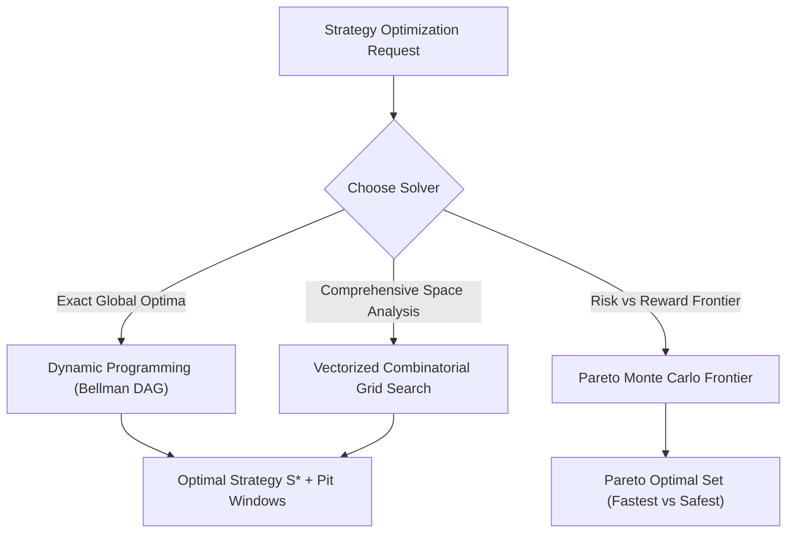

# Mathematical Formulation & Architecture: Phase 3

This document formalizes the mathematical theory, optimization algorithms, and software architecture for **Phase 3: Strategy Optimization Engine** of the Formula 1 Race Strategy Simulator.

---

## 1. Overview & System Objectives

In **Phase 1**, we implemented deterministic lap-time evaluation for manually defined strategies:
$$S \mapsto T_{\text{race}}(S)$$

In **Phase 2**, we introduced Monte Carlo uncertainty to model probability distributions over race outcomes:
$$S \mapsto \mathbb{P}\big(T_{\text{race}}(S) \le t\big), \quad \mathbb{E}[T_{\text{race}}(S)], \quad \text{Var}(T_{\text{race}}(S))$$

In **Phase 3**, the system transitions from **passive evaluation** to **active strategy discovery**:
> **Given a circuit, vehicle parameters, nominated tyre compounds, and race constraints, automatically discover the optimal pit-stop strategy $S^*$ that minimizes expected race time or minimizes strategic risk.**

$$\arg\min_{S \in \mathcal{S}_{\text{valid}}} \mathcal{J}(S)$$

---

## 2. Mathematical Formulation of the Optimization Problem

### 2.1 Decision Variables

A race strategy $S$ is parameterized by a tuple $(\mathbf{c}, \boldsymbol{\ell})$:
1. **Compound Sequence Vector:**
   $$\mathbf{c} = (c_1, c_2, \dots, c_K) \in \mathcal{C}^K$$
   where $K \in \{1, 2, 3, 4\}$ is the total number of stints ($K - 1$ pit stops), and $\mathcal{C}$ is the nominated tyre compound set (e.g., $\mathcal{C} = \{\text{Soft}, \text{Medium}, \text{Hard}\}$ or $\{C1, C2, C3\}$).

2. **Stint Length Vector:**
   $$\boldsymbol{\ell} = (\ell_1, \ell_2, \dots, \ell_K) \in \mathbb{N}^K_{\ge 1}$$
   where $\ell_k$ denotes the number of laps completed on tyre set $k$.

The resulting pit-stop laps $(p_1, p_2, \dots, p_{K-1})$ are the prefix sums of $\boldsymbol{\ell}$:
$$p_k = \sum_{j=1}^k \ell_j \quad \text{for } k \in \{1, \dots, K-1\}$$

---

### 2.2 Feasible Strategy Space ($\mathcal{S}_{\text{valid}}$)

A candidate strategy $S = (\mathbf{c}, \boldsymbol{\ell})$ belongs to the feasible space $\mathcal{S}_{\text{valid}}$ if and only if it satisfies four governing constraints:

1. **Lap Conservation Constraint:**
   $$\sum_{k=1}^K \ell_k = N$$
   where $N$ is the total race distance (e.g., $N = 57$ for Bahrain, $N = 66$ for Barcelona, $N = 53$ for Monza).

2. **FIA Mandatory Compound Diversity Constraint (Sporting Regulations):**
   In dry conditions, a driver must use at least two distinct tyre compound specifications during the race:
   $$\big| \text{Unique}(\mathbf{c}) \big| \ge 2$$

3. **Stint Length Bounds:**
   Each stint must be long enough to be physically realistic and short enough to avoid catastrophic structural tyre failure (puncture risk):
   $$\ell_{\min} \le \ell_k \le \ell_{\max}(c_k) \quad \forall k \in \{1, \dots, K\}$$
   * $\ell_{\min} \ge 3$ (minimum laps to warm tyres and complete pit cycle).
   * $\ell_{\max}(c_k) = \min\big(N, \lfloor 1.4 \times \text{cliff\_lap}(c_k) \rfloor\big)$.

4. **Maximum Pit Stop Cardinality:**
   The number of pit stops is bounded to eliminate non-competitive hyper-frequent stops:
   $$0 \le K - 1 \le K_{\max} \quad (K_{\max} = 3)$$

---

### 2.3 Objective Functions ($\mathcal{J}$)

Phase 3 supports multiple strategic objective functions depending on team risk tolerance and race position:

#### Objective 1: Minimum Deterministic Race Time (Fastest Track Pace)
$$\mathcal{J}_{\text{det}}(S) = T_{\text{race}}(S)$$
Minimizes total elapsed time assuming nominal baseline conditions, ideal for pole-sitters in clean air.

#### Objective 2: Minimum Expected Race Time (Risk-Neutral Monte Carlo)
$$\mathcal{J}_{\text{exp}}(S) = \mathbb{E}\big[T_{\text{race}}(S)\big] = \int T \cdot f_{T|S}(t) \, dt$$
Minimizes the statistical expectation over driver lap inconsistency, pit-stop delays, and degradation uncertainty.

#### Objective 3: Risk-Averse (Value-at-Risk / Worst-Case Minimax)
$$\mathcal{J}_{\text{risk}}(S; \lambda) = \mathbb{E}\big[T_{\text{race}}(S)\big] + \lambda \cdot \sigma\big(T_{\text{race}}(S)\big)$$
or minimizing the 95th percentile outcome:
$$\mathcal{J}_{\text{P95}}(S) = P_{95}\big(T_{\text{race}}(S)\big)$$
Penalizes strategies susceptible to catastrophic tyre cliff drop-offs or high pit-stop dependency.

#### Objective 4: Head-to-Head Adversarial Win Probability
$$\mathcal{J}_{\text{win}}(S; S_{\text{rival}}) = \mathbb{P}\big(T_{\text{race}}(S) < T_{\text{race}}(S_{\text{rival}})\big)$$
Maximizes the probability of beating a direct championship rival with a known strategy.

---

## 3. Optimization Algorithms & Mathematical Methods

The strategy optimization problem is a **Mixed-Discrete Constrained Combinatorial Optimization** problem. Phase 3 implements three complementary mathematical approaches:



---

### 3.1 Algorithm 1: Dynamic Programming (Bellman Backward Induction)

The race can be modeled as a deterministic **Shortest Path problem on a Directed Acyclic Graph (DAG)** across lap stages.

#### State Space
At any lap $n \in \{1, \dots, N\}$, the car state is defined by the 4-tuple:
$$\mathbf{x}_n = (n, c, a, u)$$
where:
* $n \in \{1, \dots, N\}$ is the current lap index.
* $c \in \mathcal{C}$ is the currently fitted compound.
* $a \in \{1, \dots, a_{\max}(c)\}$ is current tyre age in laps.
* $u \in \{0, 1\}$ indicates whether a second mandatory compound has already been used.

#### Action Space
At the end of lap $n$, the driver chooses action $u_n \in \{\text{STAY}\} \cup \{\text{PIT}(c') \mid c' \in \mathcal{C} \setminus \{c\}\}$.

#### Bellman Optimality Equation
Let $V(n, c, a, u)$ denote the minimum time to complete the remainder of the race from state $(n, c, a, u)$:

$$V(n, c, a, u) = \min \begin{cases} 
T_{\text{lap}}(n, c, a) + V(n+1, c, a+1, u) & \text{[Action: STAY]} \\
T_{\text{lap}}(n, c, a) + T_{\text{pit\_loss}} + \min_{c' \ne c} V(n+1, c', 1, 1) & \text{[Action: PIT to } c'\text{]}
\end{cases}$$

#### Boundary Conditions (Terminal Lap $N$)
$$V(N, c, a, u) = \begin{cases} 
T_{\text{lap}}(N, c, a) & \text{if } u = 1 \text{ (valid compound diversity)} \\ 
+\infty & \text{if } u = 0 \text{ (disqualified for single-compound violation)} 
\end{cases}$$

#### Computational Complexity
* Total states: $|\mathcal{X}| \approx N \times |\mathcal{C}| \times a_{\max} \times 2 \approx 60 \times 3 \times 45 \times 2 \approx 16,200$ states.
* Each state evaluation takes $O(1)$ operations.
* **Execution Time:** $< 15\text{ milliseconds}$ in pure Python/NumPy, guaranteeing exact global optimality without heuristic approximations.

---

### 3.2 Algorithm 2: Vectorized Combinatorial Grid Search

While Dynamic Programming produces the single best strategy, race strategists require ranking the **top 10 competing strategies** and understanding why sub-optimal alternatives fail.

#### Two-Stage Combinatorial Enumeration
1. **Discrete Compound Permutations:**
   Generate all valid sequences $\mathbf{c} \in \mathcal{C}^K$ with $|\text{Unique}(\mathbf{c})| \ge 2$ for $K \in \{2, 3, 4\}$:
   * 1-Stop ($K=2$): $3 \times 2 = 6$ sequences.
   * 2-Stop ($K=3$): $3 \times 3 \times 3 - 3 = 24$ sequences.
   * 3-Stop ($K=4$): $3^4 - 3 = 78$ sequences.

2. **Integer Compositions of Stint Lengths:**
   For a given stint count $K$ and total laps $N$, find all integer vectors $\boldsymbol{\ell} = (\ell_1, \dots, \ell_K)$ such that $\sum_{k=1}^K \ell_k = N$ and $\ell_k \ge \ell_{\min}$.
   The number of compositions is given by the stars-and-bars formula:
   $$\binom{N - K \cdot \ell_{\min} + K - 1}{K - 1}$$
   For $N = 66$ (Barcelona), $K=3$ (2-stop), and $\ell_{\min}=10$:
   $$\binom{66 - 30 + 2}{2} = \binom{38}{2} = 703 \text{ partitions per sequence}$$
   Across 24 compound sequences: $24 \times 703 \approx 16,872$ candidate strategies.

3. **High-Throughput Vectorized Evaluation:**
   Using batch NumPy vectorization, 16,872 candidate race times are evaluated in $< 200\text{ ms}$, providing an exhaustive sorted leaderboard of every valid strategy.

---

### 3.3 Algorithm 3: Pit Window Discovery & Marginal Lap Sensitivity

Real F1 strategists never pit on an isolated single lap; they operate within a **Pit Window** $[p_k - \Delta_L, p_k + \Delta_R]$ where delaying or advancing the pit stop costs less than an acceptable delta $\delta_{\text{tol}}$ (e.g. $1.0\text{s}$).

#### Marginal Rate of Substitution & Crossover Lap
The marginal lap time derivative on current tyre $c_1$ at age $a$ is:
$$\frac{d T_{\text{lap}}}{d a} = \alpha_{c_1} + 2\beta_{c_1} a + \mathbb{I}(a > a_{\text{cliff}}) \cdot 2\kappa(a - a_{\text{cliff}})$$

The crossover lap $p^*$ between continuing on tyre $c_1$ versus stopping for fresh tyre $c_2$ occurs when:
$$T_{\text{lap}}(p^*, c_1, a) - T_{\text{lap}}(p^*+1, c_2, 1) \ge \text{BreakEvenLapSavings}$$

#### Window Definition
For any optimal strategy $S^*$ with pit lap $p_k$:
$$\text{PitWindow}(p_k; \delta_{\text{tol}}) = \big\{ p \in \mathbb{N} \mid T_{\text{race}}(S^*|_{p_k \to p}) - T_{\text{race}}(S^*) \le \delta_{\text{tol}} \big\}$$

This quantifies tactical agility for reacting to Safety Cars, traffic pockets, and competitor undercuts.

---

### 3.4 Algorithm 4: Pareto Frontier Multi-Objective Optimization

In reality, the fastest deterministic strategy may carry high variance (e.g., a 1-stop that risks falling off the tyre cliff if track temperatures rise).

Phase 3 implements a **Pareto Frontier Optimizer** evaluating:
$$f_1(S) = \mathbb{E}\big[T_{\text{race}}(S)\big] \quad \text{vs} \quad f_2(S) = P_{95}\big(T_{\text{race}}(S)\big) - \mathbb{E}\big[T_{\text{race}}(S)\big] \text{ (Downside Risk)}$$

```text
Downside Risk (P95 - Mean)
        ^
        |     * High-Risk 1-Stop (Aggressive Cliff Exposure)
        |    /
        |   * Balanced 2-Stop (Pareto Efficient)
        |  /
        | * Ultra-Safe 2-Stop (Deep in Tire Comfort Zone)
        |----------------------------------------------> Expected Race Time (s)
```

A strategy $S_A$ **dominates** $S_B$ if:
$$\mathbb{E}[T(S_A)] \le \mathbb{E}[T(S_B)] \quad \text{and} \quad P_{95}(S_A) \le P_{95}(S_B)$$
with at least one strict inequality. Phase 3 identifies the non-dominated Pareto set.

---

## 4. Software Architecture & Implementation Plan

```text
src/
├── optimization.py           # Core Phase 3 optimization algorithms
│   ├── StrategyOptimizer     # Master coordinator
│   ├── DynamicProgrammingSolver # Bellman backward recursion
│   ├── CombinatorialSearchSolver # Vectorized grid search
│   └── ParetoFrontierFinder  # Multi-objective expected vs risk optimizer
├── model.py                  # Existing physical models
├── simulation.py             # Deterministic race simulator
└── montecarlo.py             # Vectorized stochastic engine
```

### 4.1 Data Structures (`src/optimization.py`)

```python
from dataclasses import dataclass
from enum import Enum
from typing import List, Optional
from src.strategies import Strategy

class OptimizationObjective(str, Enum):
    DETERMINISTIC_TIME = "deterministic_time"
    EXPECTED_TIME = "expected_time"
    MIN_RISK_P95 = "min_risk_p95"
    WIN_PROBABILITY = "win_probability"

@dataclass
class PitWindow:
    pit_index: int
    optimal_lap: int
    window_open_lap: int      # Earliest acceptable lap (delta <= tolerance)
    window_close_lap: int     # Latest acceptable lap (delta <= tolerance)
    tolerance_seconds: float

@dataclass
class OptimizationResult:
    optimal_strategy: Strategy
    optimal_race_time: float
    formatted_optimal_time: str
    pit_windows: List[PitWindow]
    top_strategies: List[Strategy]
    top_race_times: List[float]
    evaluations_count: int
    execution_time_seconds: float
    pareto_frontier: Optional[List[Strategy]] = None
```

### 4.2 Public API & CLI Experience

```bash
# Automatically optimize strategy for Bahrain
python3 run_simulation.py --circuit bahrain --optimize

# Constrain search to 2-stop strategies
python3 run_simulation.py --circuit barcelona --optimize --max-stops 2

# Optimize for lowest risk (P95) using Monte Carlo
python3 run_simulation.py --circuit monza --optimize --objective min_risk_p95 --mc 1000

# Print pit windows for the optimal strategy
python3 run_simulation.py --circuit bahrain --optimize --pit-windows
```

---

## 5. Verification & Test Plan

Phase 3 will be validated through a comprehensive test suite in `tests/test_optimization.py`:

1. **FIA Constraint Compliance Test**:
   Verify that all strategies generated by the optimizer contain at least two unique compounds and sum to exact race distance.
2. **Bellman DP vs Grid Search Equivalence**:
   Assert that the Dynamic Programming solver and the exhaustive Grid Search solver yield identical winning total race times to within $\pm 0.001\text{s}$.
3. **High-Degradation Tipping Point Test**:
   Assert that setting degradation multiplier to `1.5` (Barcelona) produces a 2-stop optimum, while setting it to `0.6` produces a 1-stop optimum.
4. **Pit Window Validity**:
   Verify that moving a pit stop within the computed Pit Window maintains total race time within the specified tolerance.
5. **Pareto Optimality**:
   Assert that no strategy in the Pareto set is strictly dominated by another strategy.
